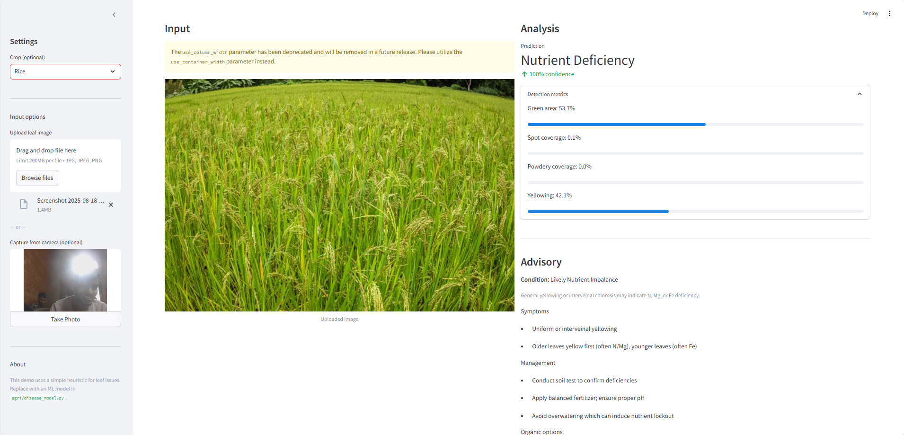

# AgriDoc Pro (Crop disease + advisory) 

AgriDoc Pro is a lightweight, private-by-default crop disease detector and advisory tool. It runs locally using a simple image heuristic to flag common leaf issues (healthy, leaf spot, powdery mildew, nutrient deficiency) and shows actionable guidance.


🚀 **Live Demo:** [Click here to try AgriDoc Pro](https://lrxjwmskn2exgqbuq6hic9.streamlit.app/)

## Features
- Upload or capture leaf photos
- Instant analysis (offline heuristic, no cloud)
- Clear advisory with prevention and management tips
- Browse guidance for common issues

## Quickstart (Windows)

1. Ensure Python 3.9+ is installed. On Windows, `py` launcher is recommended.
2. Install dependencies:

```bash
python -m pip install -r requirements.txt
```

3. Run the app:

```bash
python -m streamlit run app.py
```

4. Your browser should open automatically. If not, open `http://localhost:8501`.

## How it works (brief)

- Uses basic color/texture heuristics in HSV color space to estimate:
  - Green leaf area
  - Brown/dark spot coverage
  - White powdery coverage
  - Yellowing coverage
- Based on these metrics, assigns a label and confidence.
- Advisories are sourced from `data/diseases.json` and are shown contextually.

## Notes

- This is a starter app designed to be easy to run and extend. Replace the heuristic with an ML model later by editing `agri/disease_model.py`.
- All analysis is local; no images are uploaded anywhere.

# AgriDoc Pro 🌱

## Project Output

### Example 1


### Example 2


### Example 3


